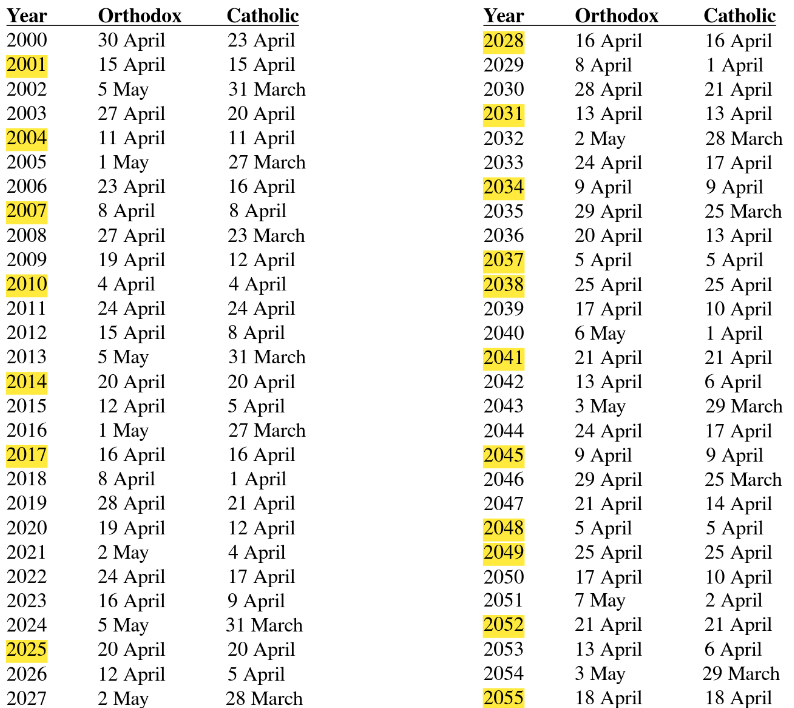

# Easter-Date

## A project made for finding Easter's date with Gauss's Algorithm.

The symbolism : [x]n = (x mod n) is being used to denote the remainder of the devision x divided by n.

Also the symbolism "Y" is being used to represent a year.

Some definitions and explanations of the following terms have been provided

1. **Metonic Cycle**
2. **Golden Number of a year**

   golden_number(year) = [Y]19 + 1 or   
   gn(Y) = [Y]19 + 1
3. **Epact of a year**

    E[Y] = [11 · (gn(Y) - 1) + 8]30 or  
    E[Y] = [11 · gn(Y) - 3]30
4. **Pascha Full Moon date**

    2 + [19 · [Y ]19 + 16]30 of April

For a complete overview of the project you can read the pdf file with name [*Finding the date of Easter with Gauss’s Algorithm: An implementation in Python*](https://github.com/kostasthanos/Easter-Date/blob/master/Finding%20the%20date%20of%20Easter%20with%20Gauss%E2%80%99s%20Algorithm:%20An%20implementation%20in%20Python.pdf) in which the above definitions are being explained in detail. In addition, at the end of the work, both Orthodox and Catholic Easter dates for the years 2000 to 2100 are presented. Finally, the years where Orthodox and Catholic dates are coincided are highlighted. Below you can see a part from the results for the years 2020 to 2030.

  

| Year | Orthodox | Catholic |  
|  --- |    ---   |    ---   |  
| 2020 | 19 April | 12 April |  
| 2021 |  2 May   |  4 April |  
| 2022 | 24 April | 17 April |  
| 2023 | 16 April |  9 April |  
| 2024 |  5 May   | 31 March |  
| **2025** | 20 April | 20 April |  
| 2026 | 12 April |  5 April |  
| 2027 |  2 May   | 28 March |  
| **2028** | 16 April | 16 April |  
| 2029 |  8 April |  1 April |  
| 2030 | 28 April | 21 April |  

Αll the mathematical calculations and algorithms presented in this work have also been implemented in Python for a better picture of the results.

##  Author
* **Konstantinos Thanos**
